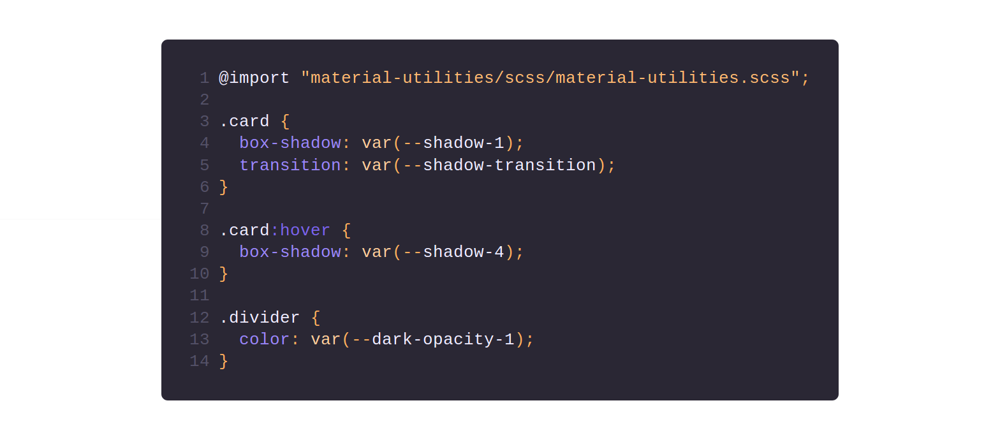

# Material Utilities

> A set of CSS custom variables & classes to bring Material shadows and opacities to your project.

[](https://www.npmjs.com/package/material-utilities) [](https://www.npmjs.com/package/material-utilities)  



If you're looking for the Material color palette, head over to [shuhei/material-colors](https://github.com/shuhei/material-colors).

Inspired by [colors](https://github.com/mrmrs/colors).

## Install

```console
$ npm install material-utilities
```

Tip: use the `--production` flag to only install the "dependencies" (so without the "devDependencies").

## Usage

### PostCSS

Import the module
```css
@import "~material-utilities/src/material-utilities.css";
```

Use the CSS custom property matching the shadow/opacity you want
```css
.card {
  box-shadow: var($shadow-1);
}
.divider {
  color: var($dark-opacity-1);
}
```

Note: You'll need a PostCSS plugins that features [CSS Custom Properties](http://www.w3.org/TR/css-variables/#defining-variables) and `@import`. I recommand [cssnext](https://github.com/MoOx/postcss-cssnext).

### SCSS

Import the module
```css
@import "~material-utilities/dist/classes.scss";
@import "~material-utilities/dist/variables.scss";
```

Use the SCSS variable  matching the shadow/opacity you want
```css
.card {
  box-shadow: var(--shadow-1);
}
.divider {
  color: var(--dark-opacity-1);
}
```

### CSS

Just add the following link in your html
```html
<link rel="stylesheet" href="https://unpkg.com/material-utilities@0.8.2/dist/material-utilities.min.css">
<!-- If you use a build tool like Gulp to concatenate your stylesheets, you should use
<link rel="stylesheet" href="path/to/module/material-utilities.min.css">
-->
```

Use the class matching the shadow/opacity you want
```html
<button class="shadow-1 shadow-transition shadow-5-hover">Download</button>
```

## Contribute

1.  [Fork](https://help.github.com/articles/fork-a-repo/) this repository to your own GitHub account and then [clone](https://help.github.com/articles/cloning-a-repository/) it to your local device.
2.  Install dependencies using npm `npm install` or Yarn: `yarn install`.
3.  Make the necessary changes.
4.  Send a pull request.

## License

MIT © [Maxime Le Conte des Floris](https://mlcdf.com)
